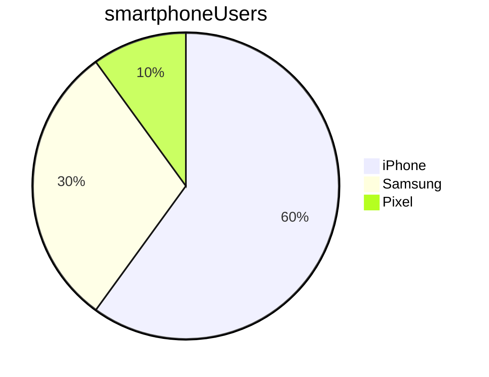

# Markdown Learning

## How to do headings

### A single hash heading

* Use a single hash for the biggest heading

## Lists
### Bulleted List
* List Item 1
- List Item 2

1. First Step
2. Second step

### Mixed List

- List item 1
  1. Ordered List 1
  2. Ordered List 2
- List Item 2

## Bold and Italics

**Hello**
_HI_
**_Mix the two_**

## Quotes

> "Hiiiiiii its me"
> >J.Chadwick
> 


## Links and Images
Here is an embedded image


Here is a link to the same image
[minecraftSkin.png](../images/minecraftSkin.png)

## Formatting code and commands
Python Code:`print("Hello World")`

This is also python code
```python
print("hello")
```

## Tables

Name    |   Street   |  Town
--------|------------|----------
Cathy   | Main St    | Birmingham
John    | Maple Drive  | Stafford


##Mermaid

